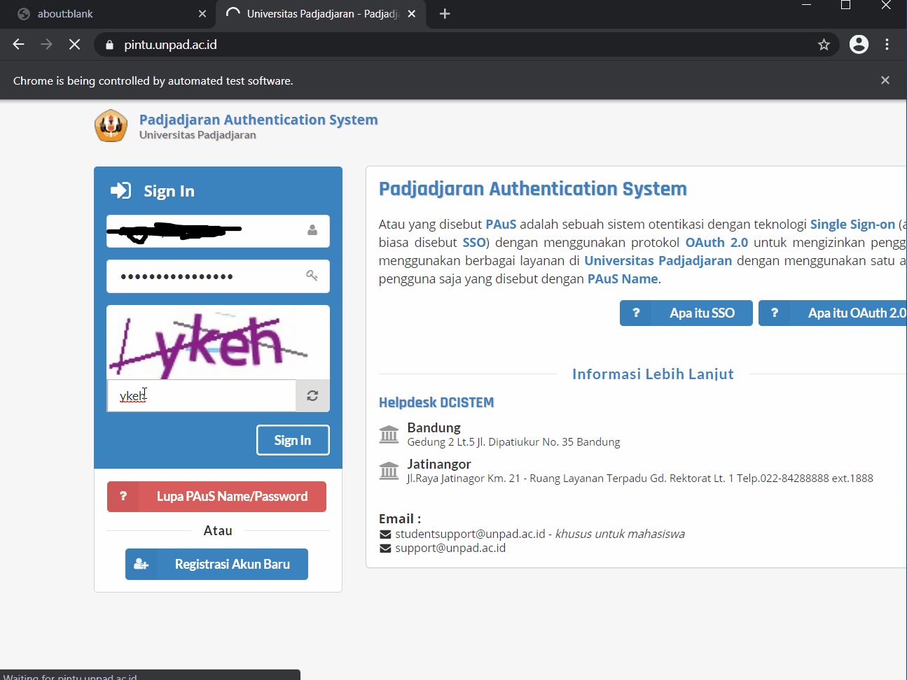

<!--
*** Thanks for checking out the Best-README-Template. If you have a suggestion
*** that would make this better, please fork the repo and create a pull request
*** or simply open an issue with the tag "enhancement".
*** Thanks again! Now go create something AMAZING! :D
***
***
***
*** To avoid retyping too much info. Do a search and replace for the following:
*** fyfirman, pacis-questionnaire-bot, twitter_handle, fyfirman@gmail.com, project_title, project_description
-->

<!-- PROJECT SHIELDS -->
<!--
*** I'm using markdown "reference style" links for readability.
*** Reference links are enclosed in brackets [ ] instead of parentheses ( ).
*** See the bottom of this document for the declaration of the reference variables
*** for contributors-url, forks-url, etc. This is an optional, concise syntax you may use.
*** https://www.markdownguide.org/basic-syntax/#reference-style-links
-->

[![LinkedIn][linkedin-shield]][linkedin-url]

<!-- PROJECT LOGO -->
<br />
<p align="center">
  <a href="https://github.com/fyfirman/questionnaire">
    
  </a>
  <h3 align="center">PACIS QUESTIONNAIRE BOT</h3>
    
  <p align="center">
    Automation fill questionnare on PACIS Unpad
    <br />
    <br />
    <br />
    <a href="https://github.com/fyfirman/pacis-questionnaire-bot">View Demo</a>
    ·
    <a href="https://github.com/fyfirman/pacis-questionnaire-bot/issues">Report Bug</a>
    ·
    <a href="https://github.com/fyfirman/pacis-questionnaire-bot/issues">Request Feature</a>
  </p>
</p>

<!-- TABLE OF CONTENTS -->
<details open="open">
  <summary>Table of Contents</summary>
  <ol>
    <li>
      <a href="#about-the-project">About The Project</a>
      <ul>
        <li><a href="#built-with">Built With</a></li>
      </ul>
    </li>
    <li>
      <a href="#getting-started">Getting Started</a>
      <ul>
        <li><a href="#prerequisites">Prerequisites</a></li>
        <li><a href="#installation">Installation</a></li>
      </ul>
    </li>
    <li><a href="#usage">Usage</a></li>
    <li><a href="#contributing">Contributing</a></li>
    <li><a href="#license">License</a></li>
    <li><a href="#contact">Contact</a></li>
  </ol>
</details>

<!-- ABOUT THE PROJECT -->

## About The Project



### Built With

- [The one and only NodeJS](https://nodejs.dev/)

<!-- GETTING STARTED -->

## Getting Started

To get a local copy up and running follow these simple steps.

### Prerequisites

- npm
  ```sh
  npm install npm@latest -g
  ```

### Installation

1. Clone the repo
   ```sh
   git clone https://github.com/fyfirman/pacis-questionnaire-bot.git
   ```
2. Install NPM packages
   ```sh
   npm install
   ```

<!-- USAGE EXAMPLES -->

## Usage

1. Copy .env.example to .env
2. Fill `PAUS_USERNAME` and `PAUS_PASSWORD` in `.env` with your PAUS credentials
3. (Optional) Fill `AZURE_COMPUTER_VISION_KEY` and `AZURE_COMPUTER_VISION_ENDPOINT` in `.env` with your Azure Computer Vision service credentials
4. Run with one of these mode

   ```sh
   # Development mode
   npm run dev

   # Production mode
   npm start
   ```

5. Fill captcha and click login if you skipped step no. 2

6. Enjoy your grades!

<!-- CONTRIBUTING -->

## Contributing

Contributions are what make the open source community such an amazing place to be learn, inspire, and create. Any contributions you make are **greatly appreciated**.

1. Fork the Project
2. Create your Feature Branch (`git checkout -b feature/AmazingFeature`)
3. Commit your Changes (`git commit -m 'Add some AmazingFeature'`)
4. Push to the Branch (`git push origin feature/AmazingFeature`)
5. Open a Pull Request

<!-- LICENSE -->

## License

Distributed under the MIT License. See `LICENSE` for more information.

Template README by [Best-README-Template](https://github.com/othneildrew/Best-README-Template)

<!-- CONTACT -->

## Contact

Firmansyah Yanuar - [@fyfirman](https://instagram.com/fyfirman) - fyfirman@gmail.com

Project Link: [https://github.com/fyfirman/pacis-questionnaire-bot](https://github.com/fyfirman/pacis-questionnaire-bot)

<!-- MARKDOWN LINKS & IMAGES -->
<!-- https://www.markdownguide.org/basic-syntax/#reference-style-links -->

[linkedin-shield]: https://img.shields.io/badge/-LinkedIn-black.svg?style=for-the-badge&logo=linkedin&colorB=555
[linkedin-url]: https://linkedin.com/in/fyfirman
